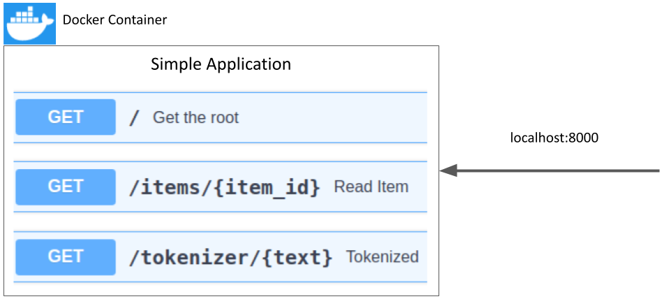

# docker_fastapi_app1
A simple application running in a Docker container accessible by localhost:8000 

## How to run
```
docker-compose -f docker-compose.yaml up --build
```

## API
<p align="center">
  
</p>
